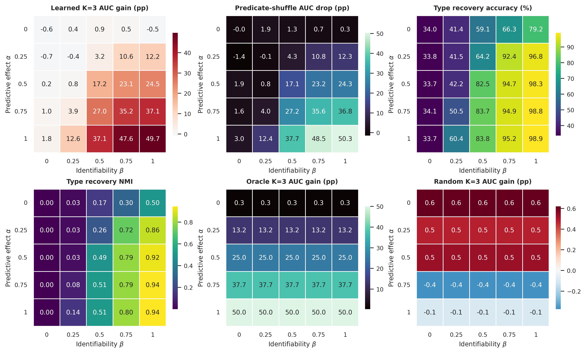

# Predicate phase diagram

## Controlled generation

Every fact is observed as the same `Link(source,destination,time)` relation, but
each of the three facts in a query has one of three hidden semantic types. The
positive semantic class contains the cyclic type sequences `(0,1,2)`, `(1,2,0)`,
and `(2,0,1)`; all other sequences form the negative semantic class. The two
classes are sampled exactly 50/50. The observed future label follows this class
with probability `0.5 + 0.5 alpha`, so `alpha` directly controls transition
difficulty: Bayes discrimination rises from chance at 0 to deterministic at 1.

Before each event, the model receives ten continuous context measurements. The
first three equal a type-specific centre multiplied by `3 beta` plus unit
Gaussian noise; the remaining seven are independent unit Gaussian nuisance
dimensions. Thus `beta` varies type identifiability without changing the future
transition distribution. Train and test contain 6,000 and 3,000 queries with
disjoint entity IDs. Results are means over seeds 7, 17, and 27 after 40 epochs.

`K=1` has one fact type. Learned `K=3` receives only context and future-link
labels. The oracle control receives the hidden type, while the random control
uses a fixed uniform assignment independent of context and label. Type recovery
is Hungarian permutation-matched fact-level accuracy; NMI and ARI provide
permutation-invariant clustering measures.

## Full grid

Each cell reports the learned `K=3` AUC change over `K=1` in percentage points.

| alpha \ beta | 0 | 0.25 | 0.50 | 0.75 | 1.00 |
|---:|---:|---:|---:|---:|---:|
| 0.00 | -0.65 | +0.39 | +0.92 | +0.53 | -0.49 |
| 0.25 | -0.72 | -0.40 | +3.24 | +10.56 | +12.21 |
| 0.50 | +0.24 | +0.79 | +17.20 | +23.10 | +24.50 |
| 0.75 | +0.99 | +3.93 | +26.99 | +35.21 | +37.14 |
| 1.00 | +1.78 | +12.56 | +37.10 | +47.62 | **+49.69** |

Permutation-matched type recovery accuracy (%):

| alpha \ beta | 0 | 0.25 | 0.50 | 0.75 | 1.00 |
|---:|---:|---:|---:|---:|---:|
| 0.00 | 33.98 | 41.40 | 59.09 | 66.33 | 79.19 |
| 0.25 | 33.80 | 41.54 | 64.19 | 92.40 | 96.76 |
| 0.50 | 33.74 | 42.16 | 82.54 | 94.72 | 98.33 |
| 0.75 | 34.06 | 50.46 | 83.70 | 94.87 | 98.77 |
| 1.00 | 33.70 | 60.38 | 83.85 | 95.18 | **98.91** |

The oracle control gains 0.34, 13.21, 25.00, 37.65, and 50.00 AUC points as
`alpha` increases and is invariant to `beta`, as required by construction. The
random-predicate gain remains between -0.37 and +0.62 points over the full grid.
At `(alpha,beta)=(1,1)`, shuffling learned predicate assignments drops AUC by
50.32 points. The smooth two-axis surface, oracle upper bound, and random
control show that the corner result is not produced merely by increasing rule
count: useful typing requires both a recoverable pre-event signal and a hidden
type that changes the conditional future distribution.

